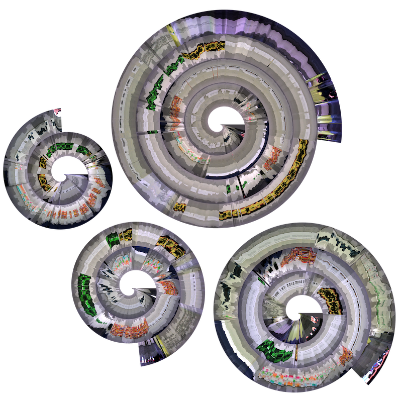

# gaze-spirals

This is the official code repository to our paper *A Spiral into the Mind: Gaze Spiral Visualization for Mobile Eye Tracking*.
You can find a post-print of our work on arXiv: https://arxiv.org/abs/2204.13494

## Overview of scripts

- `spiral.py`: Create a gaze spiral image (.png) from video and gaze input.
- `linear.py`: Create a linear slitscan (.png) from video and gaze input.
- `clock.py`: Create a real-time gaze clock from Pupil Invisible device input stream.

## Install

Install the required packages over PyPi with: `python -m pip install requirements.txt`.
Addtionaly, to run `clock.py` you need to install the Pupil Invisible's Realtime Network API with `python -m pip install pupil-labs-realtime-api`.

## Execute

### `spiral.py` and `linear.py` 

You need to specify the path to the gaze file `PATH_TO_GAZE_CONFIG`  and video file `PATH_TO_VIDEO`.
Further you need provide a gaze configuration file `PATH_TO_GAZE_CONFIG` that defines the mapping from gaze to a unified data scheme.
Configuration presets of some common vendors can be found in the directory `configurations/presets/`.
The required columns to specify are the timestamp `TIME_MS` and the gaze either from the left or right eye `[EYE] GAZE X` and `[EYE] GAZE Y`.

`python linear.py --gaze PATH_TO_GAZE --gaze_config PATH_TO_GAZE_CONFIG --video PATH_TO_VIDEO`

### `clock.py` 

Provide the IP and port of your Pupil Invisible companion device.
Make sure that your Companion device has the latest version of the Companon app installed (older version might not support the streaming API).
Also make sure that both, the Companon device, and your system on which `clock.py` is going to be exectued, are in the same local network.

`python clock.py --ip COMPANION_DEVICE_IP`

